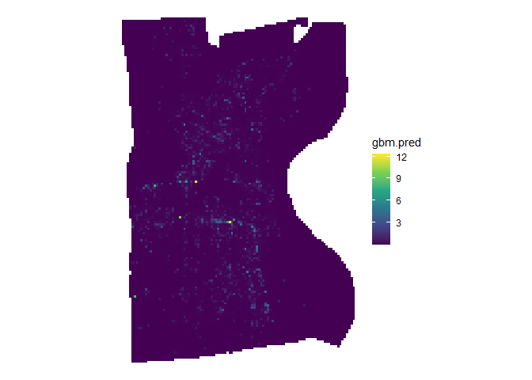

<!-- README.md is generated from README.Rmd. Please edit that file -->

# quickGrid

<!-- badges: start -->
<!-- badges: end -->

`quickgrid` is a package intended to make it easy and fast to generate
place-based crime predictions using a variety of spatial risk factors.
Tools are included in this package to help speed up the processing of
data (including calculating distance and density measures for spatial
risk factors) and the fitting of models for prediction estimates.
Currently, this package utilizes a gradient boosted tree model
implementing the `lightgbm` package. A series of wrappers help users fit
reasonable starting models using a cross-validated tuning grid. Much of
the inspiration of this package comes from an earlier paper by [Wheeler
and Steenbeck
(2020)](https://link.springer.com/article/10.1007/s10940-020-09457-7).

## Installation

You can install the current experimental version at
[GitHub](https://github.com/) with:

``` r
# install.packages("devtools")
devtools::install_github("gmcirco/quickgrid")
```

*NOTE*: There are a **lot** of changes coming in the near future!

## The Major Functions

`quickGrid` has two major functions. One sets up the raw data for model
fitting (`prep_data`) and the other simplifies the fitting of a gradient
boosted tree (GBM) model (`fit_gbm`).

### prep\_data

The general workflow for the `quickGrid` package is to first set up your
data using the `prep_data` function. This takes an outcome variable (for
example, a crime type), a named list of predictor variables, and a study
boundary and converts it into a format that can be fed into a
statistical modeling program. This function converts your study area
into *N* gridded cells, then calculates distances or densities of
various predictor variables.

### fit\_gbm

`fit_gbm` takes the data created by `prep_data` and fits a predictive
model using a tree-based boosted model via `xgboost`. While some
reasonable defaults are set for the function, it is highly recommended
that users make use of the built-in cross-validation function to help
choose parameters that will minimize overfitting. The `fit_gbm` function
will automatically fit either binary (0, 1), Poisson (0, 1, 2, ..*n*),
or regression. You can also specify custom models using the parameters
listed [here](https://xgboost.readthedocs.io/en/latest/parameter.html).

## Data Example: Hartford, CT Robberies

This is a minimum working example using the data provided in the
`quickGrid` package. `quickGrid` is packaged with an example dataset
containing robberies in Hartford CT for 2018 and 2019. A number of
spatial predictors are packed in as well, including the locations of
bars, liquor stores, gas stations, pharmacies, and dollar stores
(labeled ‘retail’). For simplicity, these are packaged as a list of `sf`
objects that can be easily plugged into our model prep function.

### Setting up your data

``` r
library(quickGrid)

data("hartford_data")

names(hartford_data)
#> [1] "hartford" "robbery"  "bar"      "liquor"   "gas"      "pharmacy" "retail"
 
model_data <-
  prep_data(
    outcome = hartford_data[['robbery']],
    pred_var = hartford_data[c("bar", "liquor", "gas", "pharmacy", "retail")],
    region = hartford_data[['hartford']],
    gridsize = 200,
    measure = 'distance')
#> [1] "Calculating distances..."
```

This will give us a list of two objects: a model dataframe with the
necessary variables attached and a shapefile corresponding to the grid
cells falling within the study boundaries. The model dataframe, in
particular, has a few important fields:

1.  X-Y coordinates and a unique grid cell identifier
2.  Grid counts of the outcome variable (denoted `n`)
3.  Distances or densities to the nearest predictor feature

``` r
# Top 6 rows of model dataframe
head(model_data$gbm_dataframe)
#>         x        y n distance.bar distance.liquor distance.gas
#> 1 1012220 854890.8 0     11952.96        2758.104     10486.70
#> 2 1012420 854890.8 0     11761.49        2563.484     10451.25
#> 3 1012620 854890.8 0     11570.31        2369.759     10419.51
#> 4 1012820 854890.8 0     11379.43        2177.169     10391.53
#> 5 1013020 854890.8 0     11188.87        1986.044     10367.33
#> 6 1013220 854890.8 0     10998.65        1796.853     10346.94
#>   distance.pharmacy distance.retail grid_id
#> 1          3965.104        2953.137      18
#> 2          3841.218        2776.535      19
#> 3          3723.957        2603.320      20
#> 4          3613.967        2434.215      21
#> 5          3511.932        2270.139      22
#> 6          3418.562        2112.263      23
```

Here we have the distances for each of the 5 predictor features for each
of the 12,896 200x200 foot cells. Now that it has been processed, this
data can be either directly fed into the `gbm_fit` function, or used in
any other model fitting function. Here, we will use it directly in the
convenient `gbm_fit` function to fit a predictive model for robberies.

### Fitting your model

Here, we’re going to fit a simple model using some parameters that were
already selected via cross-validation. We will put in the model data,
and specify a few parameters for our boosted tree-based model. We’ll set
the learning rate, `eta` to 0.3, `gamma` to 1, `max_depth` to 6, and
`min_child_weight` to 1. In addition, to help protect against
overfitting, we’ll randomly subsample 50% of the data each boosting
iteration. For more information on parameter tuning, check the [XGBoost
page](https://xgboost.readthedocs.io/en/latest/tutorials/param_tuning.html)

Finally, we’ll set `plot_importance = TRUE` to give us the feature
importance for each predictor variable.

``` r
gbm_fit <- gbm_fit(
  prep_data = model_data,
  eta = 0.3,
  gamma = 1,
  max_depth = 6,
  min_child_weight = 1,
  subsample = .5,
  nrounds = 1000,
  plot_importance = TRUE
)
#> [1] "Model type: Poisson"
#> [1] "Fitting gbm model..."
```


We can directly access the model predictions as well, by examining the
model dataframe in the `gbm_fit` output file. In this case `gbm.pred` is
the predicted number of robberies at any given grid cell. These
predictions can be used in a variety of methods - including identifying
hot-spots for crime prevention.

``` r
head(gbm_fit$model_dataframe)
#> Simple feature collection with 6 features and 11 fields
#> Geometry type: POLYGON
#> Dimension:     XY
#> Bounding box:  xmin: 1012120 ymin: 854790.8 xmax: 1013320 ymax: 854990.8
#> Projected CRS: NAD83(NSRS2007) / Connecticut (ftUS)
#>    grid_id layer       x        y n distance.bar distance.liquor distance.gas
#> 18      18  0.00 1012220 854890.8 0     11952.96        2758.104     10486.70
#> 19      19  0.00 1012420 854890.8 0     11761.49        2563.484     10451.25
#> 20      20  0.02 1012620 854890.8 0     11570.31        2369.759     10419.51
#> 21      21  0.10 1012820 854890.8 0     11379.43        2177.169     10391.53
#> 22      22  0.10 1013020 854890.8 0     11188.87        1986.044     10367.33
#> 23      23  0.10 1013220 854890.8 0     10998.65        1796.853     10346.94
#>    distance.pharmacy distance.retail    gbm.pred                       geometry
#> 18          3965.104        2953.137 0.001154631 POLYGON ((1012120 854990.8,...
#> 19          3841.218        2776.535 0.001529267 POLYGON ((1012320 854990.8,...
#> 20          3723.957        2603.320 0.002322025 POLYGON ((1012520 854990.8,...
#> 21          3613.967        2434.215 0.001908765 POLYGON ((1012720 854990.8,...
#> 22          3511.932        2270.139 0.001752649 POLYGON ((1012920 854990.8,...
#> 23          3418.562        2112.263 0.001365357 POLYGON ((1013120 854990.8,...
```

We can also plot the accumulated local effect of any predictor variable.
For example, if we wanted to know the effect of liquor stores on
robberies up to any distance, we can calculate it using the `plot_ale`
function. Here it looks like the effect is highly localized, with the
effect decaying rapidly as distance from a liquor store increases.

``` r
plot_ale(gbm_fit, 'distance.liquor')
```



### Fitting your model with cross-validation

Another (highly-suggested) option is to utilize the cross-validation
function in `gbm_fit` to determine the optimal value for the model
parameters. Currently, the cross-validation function chooses values for
the number of leaves, the learning rate, and the number of iterations.
These can be specified by adding `cv=TRUE` to the model, then providing
values for the cross-validation tuning grid for each parameter. The
cross-validation function then iteratively fits models for each of the
unique parameter combinations until an optimal one is found. For
example: if we provide 3 values for 3 of the parameters we then must
then fit 3<sup>3</sup> = 27 models. While more options are typically
better, this can become quite time intensive with many combinations. You
may wish to tune the parameters separately, check the results against
your test dataset, then re-tune the model against the other parameters.

``` r
gbm_fit_cv <- gbm_fit(prep_data = model_data,
                     cv = TRUE,
                     cv.folds = 5,
                     cv.eta = c(0.3,0.1),
                     cv.gamma = c(1),
                     cv.maxdepth = c(6,12,20),
                     cv.min_child_weight = c(1),
                     cv.subsample = c(.75,.5),
                     cv.nrounds = c(500,1000))
```
