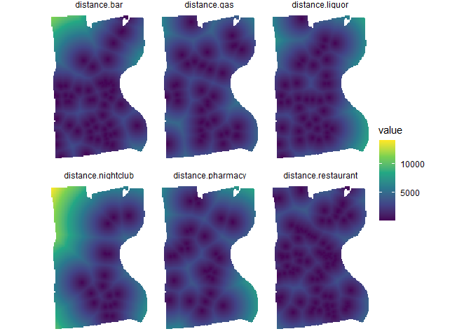

<!-- README.md is generated from README.Rmd. Please edit that file -->

# quickGrid

<!-- badges: start -->
<!-- badges: end -->

`quickgrid` is a package intended to make it easy and fast to generate
place-based crime predictions using a variety of spatial risk factors.
Tools are included in this package to help speed up the processing of
data (including calculating distance and density measures for spatial
risk factors) and the fitting of models for prediction estimates.
Currently, this package utilizes a gradient boosted tree model
implementing the `xgboost` package. A series of wrappers help users fit
reasonable starting models using a cross-validated tuning grid. Much of
the inspiration of this package comes from an earlier paper by [Wheeler
and Steenbeck
(2020)](https://link.springer.com/article/10.1007/s10940-020-09457-7).

This package is still in its infancy (as of 2021-06-14). A number of
features are planned for the future, including:

-   ~~Predictive Accuracy Index (PAI) calculation~~
-   GoogleMaps & OpenStreet Maps integration
-   Grid count and polygon-level predictors
-   Shapely value decomposition
-   and more…!

## Installation

You can install the current experimental version at
[GitHub](https://github.com/) with:

``` r
# install.packages("devtools")
devtools::install_github("gmcirco/quickgrid")
```

## The Major Functions

`quickGrid` has two major functions. One sets up the raw data for model
fitting (`prep_data`) and the other simplifies the fitting of a gradient
boosted tree (GBM) model (`fit_gbm`).

### prep\_data

The general workflow for the `quickGrid` package is to first set up your
data using the `prep_data` function. This takes an outcome variable (for
example, a crime type), a named list of predictor variables, and a study
boundary and converts it into a format that can be fed into a
statistical modeling program. This function converts your study area
into *N* gridded cells, then calculates distances or densities of
various predictor variables.

### fit\_gbm

`fit_gbm` takes the data created by `prep_data` and fits a predictive
model using a tree-based boosted model via `xgboost`. While some
reasonable defaults are set for the function, it is highly recommended
that users make use of the built-in cross-validation function to help
choose parameters that will minimize overfitting. The `fit_gbm` function
will automatically fit either binary (0, 1), Poisson (0, 1, 2, ..*n*),
or regression for non-discrete outcomes. You can also specify custom
models using the parameters listed
[here](https://xgboost.readthedocs.io/en/latest/parameter.html).

## Data Example: Hartford, CT Robberies

This is a minimum working example using the data provided in the
`quickGrid` package. `quickGrid` is packaged with an example dataset
containing robberies in Hartford CT for 2017 though 2019. A number of
spatial predictors are included as well, including the locations of
bars, night clubs, liquor stores, gas stations, pharmacies, and
restaurants. For simplicity, these are packaged as a list of named `sf`
objects that can be easily plugged into our model prep function.

### Setting up your data

Because we are interested in *future* predictions, we should first split
our data into a [test and train
dataset](https://developers.google.com/machine-learning/crash-course/training-and-test-sets/splitting-data).
Here, we will use 2017 - 2018 data for training, and 2019 for evaluating
our predictions.

``` r
library(quickGrid)

# Load data and examine feature names

data("hartford_data")

names(hartford_data)
#> [1] "hartford"   "robbery"    "bar"        "nightclub"  "liquor"    
#> [6] "gas"        "pharmacy"   "restaurant"

# Split data into test-train
robbery_train <- dplyr::filter(hartford_data[[2]], substr(date,1,4) %in% 2017:2018)
robbery_test <- dplyr::filter(hartford_data[[2]], substr(date,1,4) == 2019)
```

Now we can train our model on the 2017 and 2018 robberies, using the
predictor variables and measuring by nearest distance.

``` r
# Create an object to hold model data
# using 'prep_data' function

model_data <- prep_data(outcome = robbery_train,
                       pred_var = hartford_data[c('bar','nightclub','liquor','gas','pharmacy','restaurant')],
                       region = hartford_data$hartford,
                       gridsize = 200,
                       measure = 'distance')
#> Calculating distances...
```

This will give us a list of two objects: a model dataframe with the
necessary variables attached and a shapefile corresponding to the grid
cells falling within the study boundaries. The model dataframe, in
particular, has a few important fields:

1.  x-y coordinates and a unique grid cell identifier
2.  Grid counts of the outcome variable (denoted `n`)
3.  Distances or densities to the nearest predictor feature (denoted
    `distance.` or `.density.`)

``` r
# Top 6 rows of model dataframe
head(model_data$gbm_dataframe)
#>         x        y n distance.bar distance.nightclub distance.liquor
#> 1 1012220 854890.8 0    10130.460           11626.01        2758.104
#> 2 1012420 854890.8 0    10064.503           11479.73        2563.484
#> 3 1012620 854890.8 0    10002.112           11335.10        2369.759
#> 4 1012820 854890.8 0     9943.352           11192.17        2177.169
#> 5 1013020 854890.8 0     9888.289           11051.01        1986.044
#> 6 1013220 854890.8 0     9836.984           10911.70        1796.853
#>   distance.gas distance.pharmacy distance.restaurant grid_id
#> 1     3042.943          3965.104            2577.497      18
#> 2     2862.412          3841.218            2382.150      19
#> 3     2684.642          3723.957            2187.644      20
#> 4     2510.220          3613.967            1994.225      21
#> 5     2339.894          3511.932            1802.244      22
#> 6     2174.627          3418.562            1612.213      23
```

Here we have the distances for each of the 5 predictor features for each
of the 12,896 200x200 foot cells. Now that it has been processed, this
data can be either directly fed into the `gbm_fit` function, or used in
any other model fitting function. Here, we will use it directly in the
convenient `gbm_fit` function to fit a predictive model for robberies.

### Fitting your model

Here, we’re going to fit a simple model using some parameters that were
already selected via cross-validation. We will put in the model data,
and specify a few parameters for our boosted tree-based model. We’ll set
the learning rate, `eta` to 0.3, `gamma` to 1, `max_depth` to 6, and
`min_child_weight` to 1. In addition, to help protect against
overfitting, we’ll randomly subsample 50% of the data each boosting
iteration. For more information on parameter tuning, check the [XGBoost
page](https://xgboost.readthedocs.io/en/latest/tutorials/param_tuning.html)

Finally, we’ll set `plot_importance = TRUE` to give us the feature
importance for each predictor variable.

``` r
gbm_fit <- gbm_fit(
  prep_data = model_data,
  eta = 0.3,
  gamma = 1,
  max_depth = 6,
  min_child_weight = 1,
  subsample = .5,
  nrounds = 1000,
  plot_importance = TRUE
)
#> Model type: Poisson
#> Fitting gbm model...
```


We can directly access the model predictions as well, by examining the
model dataframe in the `gbm_fit` output file. In this case `gbm.pred` is
the predicted number of robberies at any given grid cell. These
predictions can be used in a variety of methods - including identifying
hot-spots for crime prevention.

``` r
head(gbm_fit$model_dataframe)
#> Simple feature collection with 6 features and 12 fields
#> Geometry type: POLYGON
#> Dimension:     XY
#> Bounding box:  xmin: 1012120 ymin: 854790.8 xmax: 1013320 ymax: 854990.8
#> Projected CRS: NAD83(NSRS2007) / Connecticut (ftUS)
#>    grid_id layer       x        y n distance.bar distance.nightclub
#> 18      18  0.00 1012220 854890.8 0    10130.460           11626.01
#> 19      19  0.00 1012420 854890.8 0    10064.503           11479.73
#> 20      20  0.02 1012620 854890.8 0    10002.112           11335.10
#> 21      21  0.10 1012820 854890.8 0     9943.352           11192.17
#> 22      22  0.10 1013020 854890.8 0     9888.289           11051.01
#> 23      23  0.10 1013220 854890.8 0     9836.984           10911.70
#>    distance.liquor distance.gas distance.pharmacy distance.restaurant
#> 18        2758.104     3042.943          3965.104            2577.497
#> 19        2563.484     2862.412          3841.218            2382.150
#> 20        2369.759     2684.642          3723.957            2187.644
#> 21        2177.169     2510.220          3613.967            1994.225
#> 22        1986.044     2339.894          3511.932            1802.244
#> 23        1796.853     2174.627          3418.562            1612.213
#>       gbm.pred                       geometry
#> 18 0.009015617 POLYGON ((1012120 854990.8,...
#> 19 0.003779165 POLYGON ((1012320 854990.8,...
#> 20 0.021006990 POLYGON ((1012520 854990.8,...
#> 21 0.009862104 POLYGON ((1012720 854990.8,...
#> 22 0.007123667 POLYGON ((1012920 854990.8,...
#> 23 0.002528116 POLYGON ((1013120 854990.8,...
```

## Plotting Functions

`quickGrid` also comes with a few functions to help visualize the
results from your prediction model. In general, we are much more
interested in the *predictions* that come from the model than the
individual impact of a single parameter. In addition, boosted tree-based
models will generate hundreds (or even thousands) of weak learners, that
make individual parameters difficult to examine.

### plot\_gbm

The `plot_gbm` function can be used to simply plot the grid-based
predictions from the model function. This would correspond to a ‘risk’
map, where higher values imply a higher probability of a crime occuring
in that grid cell in the future. Plotting this map is easy: all you have
to provide is the name of the model list generated by the `gbm_fit`
function.

``` r
plot_gbm(gbm_fit)
```


In addition, you can also examine the value of one or more of your model
predictors. If you want to see the grid values for your ‘distance’
parameter, you can plot them individually. For example, looking at the
distance of every grid cell to the nearest bar could be done by
specifying `feature = 'distance.bar'`. You can also plot *all* distance
or density values by simply added `feature = 'distance'`.

``` r
plot_gbm(gbm_fit, feature = 'distance')
```



### plot\_ale

We can also plot the accumulated local effect (see
[here](https://arxiv.org/pdf/1612.08468.pdf) for more) of any predictor
variable. For example, if we wanted to know the effect of liquor stores
on robberies up to any distance, we can calculate it using the
`plot_ale` function. Here it looks like the effect is highly localized,
with the effect decaying rapidly as distance from a liquor store
increases.

``` r
plot_ale(gbm_fit, 'distance.liquor')
```


### Fitting your model with cross-validation

Another (highly-suggested) option is to utilize the cross-validation
function in `gbm_fit` to determine the optimal value for the model
parameters. Currently, the cross-validation function chooses values for
the number of leaves, the learning rate, and the number of iterations.
These can be specified by adding `cv=TRUE` to the model, then providing
values for the cross-validation tuning grid for each parameter. The
cross-validation function then iteratively fits models for each of the
unique parameter combinations until an optimal one is found. For
example: if we provide 3 values for 3 of the parameters we then must
then fit 3<sup>3</sup> = 27 models. While more options are typically
better, this can become quite time intensive with many combinations. You
may wish to tune the parameters separately, check the results against
your test dataset, then re-tune the model against the other parameters.
This is a more time consuming process, but will almost always result in
better predictions than ad-hoc parameter selection.

``` r
gbm_fit_cv <- gbm_fit(prep_data = model_data,
                     cv = TRUE,
                     cv.folds = 5,
                     cv.eta = c(0.3,0.1),
                     cv.gamma = c(1),
                     cv.maxdepth = c(6,12,20),
                     cv.min_child_weight = c(1),
                     cv.subsample = c(.75,.5),
                     cv.nrounds = c(500,1000))
```

## Evaluating Model Performace

There are three possible options for evaluating the [accuracy of
predictions](https://link.springer.com/article/10.1007/s10940-020-09457-7#Sec14)
from your model:

1.  The *predictive accuracy index* (PAI), which is the simply the
    proportion of crimes predicted divided by the number of hotspots
2.  The *predictive efficiency index* (PEI), which is the ratio of the
    observed PAI to the (hypothetical) best possible PAI. Values closer
    to one imply more accurate models.
3.  The *recapture rate index* (RRI), which measures the relative
    accuracy of hot spots. This is the ratio of the number of crimes
    predicted by the model to the number of observed crimes. Values
    above one imply more crimes are predicted than observed, while
    values below one imply fewer crimes are predicted than observed.

### `outcome_eval`

The `outcome_eval` function allows the calculation of one or more of the
above metrics. You can specify one or a list of two or more. The default
cutoff for a hotspot is the top 1% of regions (`cutoff = 0.01`).

``` r
# Plot model performance on test data
# PAI, PEI, RRI
outcome_eval(model_fit = gbm_fit, 
             test_data = robbery_test,
             eval = c("pai","pei","rri"))
#>   PAI   PEI   RRI 
#> 18.73  0.31  6.10
```

### `plot_eval`

There is also the option to plot evaluations across a range of hotspot
values. This helps to identify the performace of the model conditional
on different hot spot cutoffs. The `plot_eval` function can plot any of
the three metrics across any range of values. The default is 0.1% to 1%.

``` r
plot_eval(model_fit = gbm_fit, 
             test_data = robbery_test,
             eval = "pai")
```


