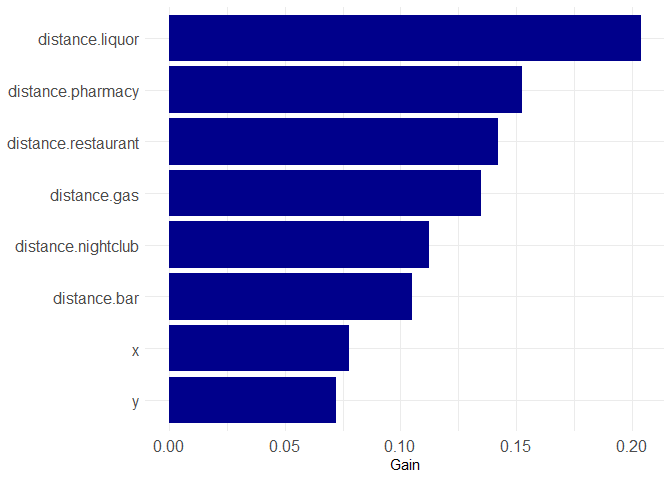

<!-- README.md is generated from README.Rmd. Please edit that file -->

# quickGrid

<!-- badges: start -->
<!-- badges: end -->

`quickgrid` is a package intended to make it easy and fast to generate
place-based crime predictions using a variety of spatial risk factors.
Tools are included in this package to help speed up the processing of
data (including calculating distance and density measures for spatial
risk factors) and the fitting of models for prediction estimates.
Currently, this package utilizes a gradient boosted tree model
implementing the `lightgbm` package. A series of wrappers help users fit
reasonable starting models using a cross-validated tuning grid. Much of
the inspiration of this package comes from an earlier paper by [Wheeler
and Steenbeck
(2020)](https://link.springer.com/article/10.1007/s10940-020-09457-7).

## Installation

You can install the current experimental version at
[GitHub](https://github.com/) with:

``` r
# install.packages("devtools")
devtools::install_github("gmcirco/quickgrid")
```

## The Major Functions

`quickGrid` has two major functions. One sets up the raw data for model
fitting (`prep_data`) and the other simplifies the fitting of a lightgbm
model (`fit_lgbm`).

### prep\_data

The general workflow for the `quickGrid` package is to first set up your
data using the `prep_data` function. This takes an outcome variable (for
example, a crime type), a named list of predictor variables, and a study
boundary and converts it into a format that can be fed into a
statistical modeling program. This function converts your study area
into *N* gridded cells, then calculates distances or densities of
various predictor variables.

### fit\_lgbm

`fit_lgbm` takes the data created by `prep_data` and fits a predictive
model using a tree-based boosted model via `lightgbm`. While some
reasonable defaults are set for the function, it is highly recommended
that users make use of the built-in cross-validation function to help
choose parameters that will minimize overfitting. The `fit_lgbm`
function will automatically fit either binary (0, 1), Poisson
(0, 1, 2, ..*n*), or regression. You can also specify custom models
using the parameters listed
[here](https://lightgbm.readthedocs.io/en/latest/Parameters.html).

## Data Example: Hartford, CT Robberies

This is a minimum working example using the data provided in the
`quickGrid` package[1]. `quickGrid` is packaged with an example dataset
containing robberies in Hartford CT for 2018 and 2019. A number of
spatial predictors are packed in as well, including the locations of
bars, liquor stores, gas stations, pharmacies, and dollar stores
(labeled ‘retail’). For simplicity, these are packaged as a list of `sf`
objects that can be easily plugged into our model prep function.

### Setting up your data

``` r
library(lightgbm)
#> Loading required package: R6
library(quickGrid)

data("hartford_data")

names(hartford_data)
#> [1] "hartford" "robbery"  "bar"      "liquor"   "gas"      "pharmacy" "retail"
 
model_data <-
  prep_data(
    outcome = hartford_data[['robbery']],
    pred_var = hartford_data[c("bar", "liquor", "gas", "pharmacy", "retail")],
    region = hartford_data[['hartford']],
    gridsize = 200,
    measure = 'distance')
#> [1] "Calculating distances..."
```

This will give us a list of two objects: a model dataframe with the
necessary variables attached and a shapefile corresponding to the grid
cells falling within the study boundaries. The model dataframe, in
particular, has a few important fields:

1.  X-Y coordinates and a unique grid cell identifier
2.  Grid counts of the outcome variable (denoted `n`)
3.  Distances or densities to the nearest predictor feature

``` r
# Top 6 rows of model dataframe
head(model_data$lgbm_dataframe)
#>         x        y grid_id n      bar   liquor      gas pharmacy   retail
#> 1 1009620 824500.8       1 0 7386.051 11624.34 9124.581 8562.921 6149.811
#> 2 1009820 824500.8       2 0 7260.199 11440.13 8952.365 8384.448 6132.109
#> 3 1010020 824500.8       3 0 7137.732 11256.45 8781.327 8206.968 6120.895
#> 4 1010220 824500.8       4 0 7018.829 11073.34 8611.536 8030.547 6116.203
#> 5 1010420 824500.8       5 0 6903.672 10890.82 8443.069 7855.256 6118.049
#> 6 1010620 824500.8       6 0 6792.453 10708.93 8276.006 7681.173 6126.427
```

Here we have the distances for each of the 5 predictor features for each
of the 12,901 cell 200x200 foot cells. Now that it has been processed,
this data can be either directly fed into the `lgbm_fit` function, or
used in any other model fitting function. Here, we will use it directly
in the convenient `lgbm_fit` function to fit a predictive model for
robberies.

### Fitting your model

Here, we’re going to fit a simple model using some parameters that were
already selected via cross-validation. We will put in the model data,
and specify a few parameters for our boosted tree-based model. We’ll set
the maximum number of leaves to 20, the learning rate to 0.01, and the
number of iterations to 750. In addition, to protect against overfitting
we’ll set the bagging fraction to .5, and the bagging frequency to 5.
For more information on parameter tuning, check the [lightgbm
page](https://lightgbm.readthedocs.io/en/latest/Parameters-Tuning.html)

Finally, we’ll set `plot = TRUE` and `plot_importance = TRUE` to give us
the predicted grid values on a map and the feature importance for each
predictor variable.

``` r
gbm_fit <- lgbm_fit(prep_data = model_data,
                    nleaves =  20,
                    mindata = 100,
                    maxdepth = 7,
                    lrate = 0.01,
                    nrounds = 750,
                    bag_frac = .5,
                    bag_freq = 5,
                    plot = TRUE,
                    plot_importance = TRUE)
#> [1] "Model type: Poisson"
#> [1] "Fitting lgbm model..."
```



We can directly access the model predictions as well, by examining the
model dataframe in the `lgbm_fit` output file. In this case `gbm.pred`
is the predicted number of robberies at any given grid cell. These
predictions can be used in a variety of methods - including identifying
hot-spots for crime prevention.

``` r
head(gbm_fit$model_dataframe)
#> Simple feature collection with 6 features and 10 fields
#> Geometry type: POLYGON
#> Dimension:     XY
#> Bounding box:  xmin: 1009520 ymin: 824400.8 xmax: 1010720 ymax: 824600.8
#> Projected CRS: NAD83(NSRS2007) / Connecticut (ftUS)
#>   grid_id       x        y n      bar   liquor      gas pharmacy   retail
#> 1       1 1009620 824500.8 0 7386.051 11624.34 9124.581 8562.921 6149.811
#> 2       2 1009820 824500.8 0 7260.199 11440.13 8952.365 8384.448 6132.109
#> 3       3 1010020 824500.8 0 7137.732 11256.45 8781.327 8206.968 6120.895
#> 4       4 1010220 824500.8 0 7018.829 11073.34 8611.536 8030.547 6116.203
#> 5       5 1010420 824500.8 0 6903.672 10890.82 8443.069 7855.256 6118.049
#> 6       6 1010620 824500.8 0 6792.453 10708.93 8276.006 7681.173 6126.427
#>      gbm.pred                       geometry
#> 1 0.003564445 POLYGON ((1009520 824400.8,...
#> 2 0.003564445 POLYGON ((1009720 824400.8,...
#> 3 0.003162640 POLYGON ((1009920 824400.8,...
#> 4 0.002891697 POLYGON ((1010120 824400.8,...
#> 5 0.003666776 POLYGON ((1010320 824400.8,...
#> 6 0.003666776 POLYGON ((1010520 824400.8,...
```

We can also plot the accumulated local effect of any predictor variable.
For example, if we wanted to know the effect of liquor stores on
robberies up to any distance, we can calculate it using the `plot_ale`
function. Here it looks like the effect is highly localized, with the
effect decaying rapidly as distance from a liquor store increases.

``` r
plot_ale(gbm_fit, 'liquor')
```


### Fitting your model with cross-validation

Another (highly-suggested) option is to utilize the cross-validation
function in `lgbm_fit` to determine the optimal value for the model
parameters. Currently, the cross-validation function chooses values for
the number of leaves, the learning rate, and the number of iterations.
These can be specified by adding `cv=TRUE` to the model, then providing
values for the cross-validation tuning grid for each parameter. The
cross-validation function then iteratively fits models for each of the
unique parameter combinations until an optimal one is found. If we
provide 3 values for 3 of the parameters we must then fit
3<sup>3</sup> = 27 models. While more options are typically better, this
can become quite time intensive with many combinations. You may wish to
tune the parameters separately, check the results against your test
dataset, then re-tune the model against the other parameters.

``` r
gbm_fit_cv <- lgbm_fit(prep_data = model_data,
                    cv = TRUE,
                    cv.folds = 5,
                    cv.nleaves = c(5,10,20),
                    cv.mindata = c(50,100),
                    cv.maxdepth = c(7,10,20),
                    cv.lrate = 0.01,
                    cv.nrounds = 750,
                    bag_frac = .5,
                    bag_freq = 5)
```

[1] **NOTE**: Currently a bug in the R version of `lightgbm` can cause
crashes if it is loaded *after* any tidyverse packages. The only
solution is to ensure you load `lightgbm` prior to doing anything else.
See [here](https://github.com/microsoft/LightGBM/issues/4007) for more
info. This will be fixed in future versions.
